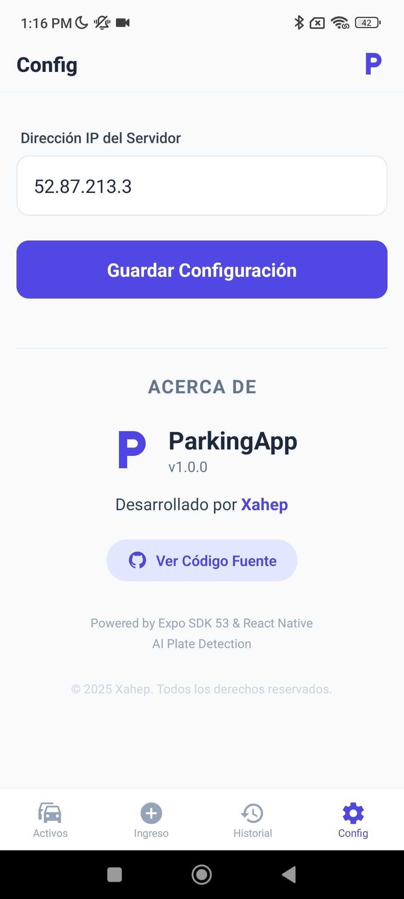
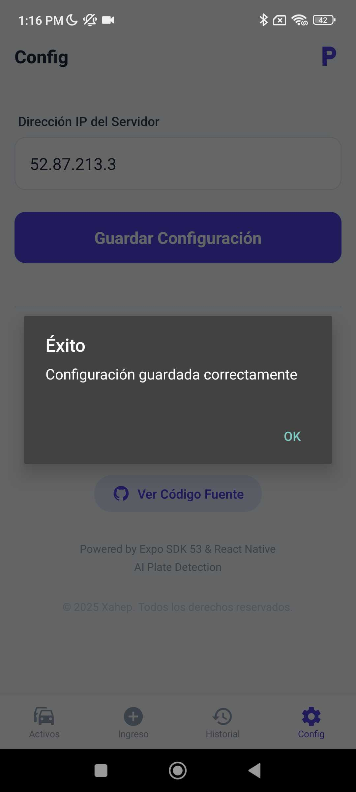
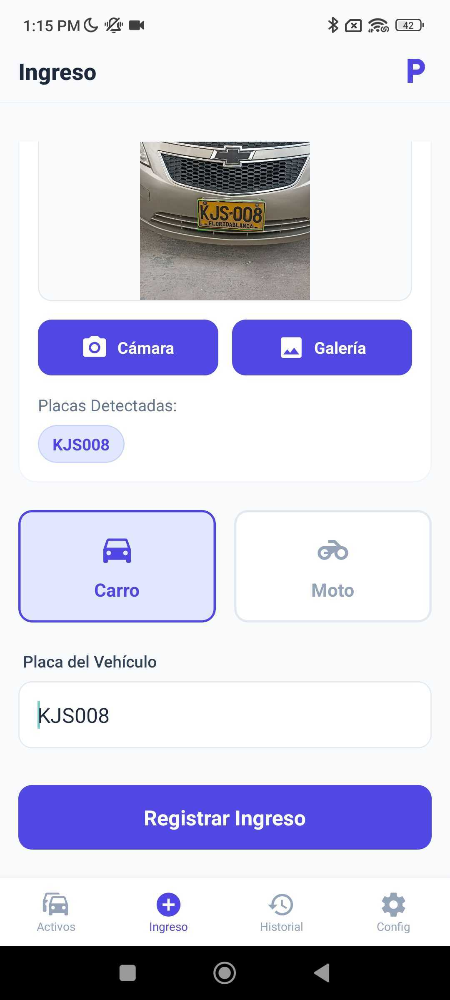
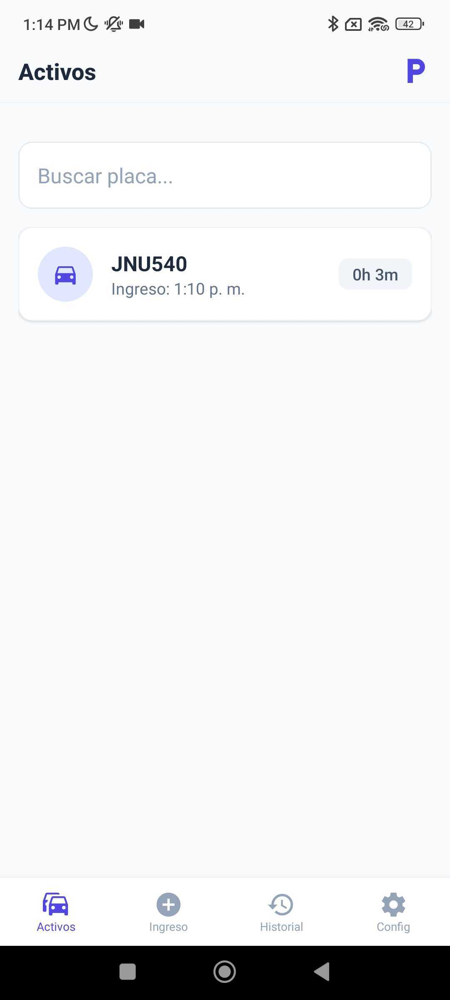
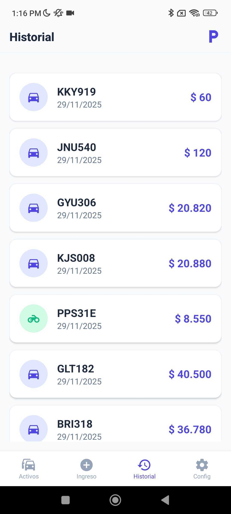

# 🚗 ParkingApp - Sistema Inteligente de Gestión de Parqueaderos

ParkingApp es una solución móvil integral diseñada para modernizar y optimizar la administración de parqueaderos. Utilizando tecnologías de vanguardia como **React Native**, **Expo** e **Inteligencia Artificial**, esta aplicación permite un control eficiente del flujo vehicular, automatizando el registro de placas y el cálculo de tarifas.

---

## 📋 Tabla de Contenido

1. [Descripción del Proyecto](#-descripción-del-proyecto)
2. [Características Principales](#-características-principales)
3. [Instalación y Configuración](#-instalación-y-configuración)
4. [Tecnologías Utilizadas](#-tecnologías-utilizadas)
5. [Evidencia del Funcionamiento](#-evidencia-del-funcionamiento)

---

## 📖 Descripción del Proyecto

El objetivo de ParkingApp es eliminar los procesos manuales y propensos a errores en la gestión de estacionamientos. La aplicación ofrece una interfaz intuitiva para los operarios, permitiéndoles registrar ingresos y salidas de vehículos de manera rápida y precisa.

### Flujo de Trabajo
1.  **Ingreso**: El operario captura una foto de la placa del vehículo. La IA procesa la imagen y extrae el número de placa automáticamente.
2.  **Validación**: El sistema verifica el formato de la placa y permite correcciones manuales si es necesario.
3.  **Registro**: Se guarda la hora de entrada y el tipo de vehículo (Carro/Moto).
4.  **Salida**: Al momento de salir, el sistema calcula automáticamente el costo basado en el tiempo transcurrido y las tarifas configuradas.

---

## 🚀 Características Principales

-   **🤖 Detección de Placas con IA**: Integración con servicios de visión artificial para leer placas automáticamente desde la cámara o galería, reduciendo el tiempo de digitación.
-   **💰 Tarifas Dinámicas**: Cálculo automático del costo exacto por minuto (Carros: $3.600/h, Motos: $1.500/h).
-   **📱 Gestión de Vehículos**: Listado en tiempo real de vehículos activos dentro del parqueadero.
-   **📜 Historial Completo**: Registro detallado de todos los movimientos (entradas y salidas) para auditoría.
-   **💾 Persistencia de Datos**: Almacenamiento local seguro usando `AsyncStorage`, garantizando que la información no se pierda al cerrar la app.
-   **⚙️ Configuración Flexible**: Permite configurar la dirección IP del servidor de IA directamente desde la app.

---

## 🚀 Instalación y Configuración

### Prerrequisitos
- Node.js (v16 o superior)
- npm o yarn
- Expo CLI
- Cuenta de Expo (para builds)

### Instalación

```bash
# Clonar el repositorio
git clone https://github.com/Xahep/detector-placas-app.git
cd detector-placas-app

# Instalar dependencias
npm install

# Iniciar en modo desarrollo
npx expo start
```

### Configuración del Servidor de IA

1. Ve a la pestaña **Configuración**
2. Ingresa la IP de tu servidor de detección de placas
3. El servidor debe exponer el endpoint: `POST http://{IP}:8080/predict`

#### Formato de Request
```
Content-Type: multipart/form-data
Body: { file: <imagen> }
```

#### Formato de Response
```json
{
  "success": true,
  "placas": ["ABC123", "XYZ789"],
  "num_placas": 2,
  "image": "base64_string...",
  "message": "OK"
}
```

### (Opcional) Descarga del APK (Android)
Puedes descargar la última versión de la aplicación directamente desde Expo:

[**⬇️ Descargar ParkingApp APK**](https://expo.dev/accounts/xahepg/projects/parking-app/builds/e7addf4c-b17d-45c1-bec3-60a89866c083)

> **Nota:** Esta versión es un "Preview Build" generado con EAS.

### Configuración de Red (Importante)
La aplicación está configurada para permitir tráfico **HTTP (texto plano)**. Esto es necesario para comunicarse con el backend de pruebas en EC2 (`http://IP:PUERTO`). Esta configuración se maneja a través del plugin `expo-build-properties` en `app.json`.

---

## 🛠 Tecnologías Utilizadas

*   **Frontend**: React Native, Expo SDK 53, TypeScript.
*   **Navegación**: React Navigation (Bottom Tabs, Native Stack).
*   **Estilos**: StyleSheet (Diseño responsivo y limpio).
*   **Cámara e Imágenes**: `expo-camera`, `expo-image-picker`.
*   **Almacenamiento**: `@react-native-async-storage/async-storage`.
*   **Red**: `fetch` API con soporte para `multipart/form-data`.

---

## 📸 Evidencia del Funcionamiento

A continuación se presenta la evidencia visual del funcionamiento de la aplicación en sus diferentes módulos.

### 🎥 Videos Demostrativos

| Backend (Servicio IA) | Frontend (App Móvil) |
| :---: | :---: |
|  |  |
| *Prueba del servicio de predicción* | *Flujo completo de uso en la App* |

### 🖼 Capturas de Pantalla

#### 1. Configuración Inicial
Pantalla para establecer la conexión con el servidor de IA.

<p align="center">
  
  
</p>

#### 2. Registro de Ingreso (IA)
Proceso de captura y detección de placa.

<p align="center">
  
  
</p>

#### 3. Gestión de Activos
Listado de vehículos actualmente en el parqueadero.

<p align="center">
  
</p>

#### 4. Historial
Registro histórico de vehículos que han salido.

<p align="center">
  
</p>

### ➕ Ingreso
- Captura de foto con cámara o selección desde galería
- Detección automática de placas con IA
- Selección de tipo de vehículo (Carro/Moto)
- Validación flexible de formatos de placas
- Registro manual como alternativa

### 📚 Historial
- Registro completo de servicios finalizados
- Visualización de costos y fechas
- Ordenamiento cronológico

### ⚙️ Configuración
- Configuración de IP del servidor de IA
- Persistencia de configuración

## 💵 Tarifas

- **Carros**: $3.600 COP/hora
- **Motos**: $1.500 COP/hora
- Cálculo proporcional por minuto para mayor precisión

## 🔐 Validación de Placas

### Formatos Válidos (Colombia)
- **Carros**: 3 letras + 3 números (Ej: ABC123)
- **Motos**: 3 letras + 2 números + 1 letra (Ej: AAA12A)

### Validación Flexible
La app permite guardar placas con formato no estándar mostrando una advertencia, útil para casos especiales o errores de detección de la IA.

## 📦 Generar APK/IPA

### Android (APK)

```bash
# Instalar EAS CLI
npm install -g eas-cli

# Iniciar sesión
eas login

# Generar APK de prueba
eas build -p android --profile preview
```

### iOS

```bash
# Generar IPA (requiere cuenta de desarrollador Apple)
eas build -p ios
```

## 📂 Estructura del Proyecto

```
detector-placas-app/
├── src/
│   ├── components/       # Componentes reutilizables
│   │   ├── Button.tsx
│   │   ├── Input.tsx
│   │   ├── Layout.tsx
│   │   └── VehicleCard.tsx
│   ├── screens/          # Pantallas principales
│   │   ├── ActiveScreen.tsx
│   │   ├── EntryScreen.tsx
│   │   ├── HistoryScreen.tsx
│   │   └── ConfigScreen.tsx
│   ├── services/         # Servicios externos
│   │   └── api.ts
│   ├── types/            # Definiciones TypeScript
│   │   └── index.ts
│   └── utils/            # Utilidades
│       ├── logic.ts      # Lógica de negocio
│       └── storage.ts    # Persistencia
├── assets/               # Recursos estáticos
├── App.tsx              # Punto de entrada
├── app.json             # Configuración Expo
├── eas.json             # Configuración EAS Build
└── package.json         # Dependencias
```

## 🎨 Paleta de Colores

- **Primario**: Indigo (#4f46e5)
- **Fondo**: Slate 50 (#f8fafc)
- **Texto**: Slate 800 (#1e293b)
- **Bordes**: Slate 200 (#e2e8f0)
- **Advertencia**: Amber 500 (#f59e0b)
- **Error**: Red 500 (#ef4444)

## 🤝 Contribuciones

Las contribuciones son bienvenidas. Por favor:

1. Fork el proyecto
2. Crea una rama para tu feature (`git checkout -b feature/AmazingFeature`)
3. Commit tus cambios (`git commit -m 'Add some AmazingFeature'`)
4. Push a la rama (`git push origin feature/AmazingFeature`)
5. Abre un Pull Request

## 📄 Licencia

Este proyecto es de código abierto y está disponible bajo la licencia MIT.

## 👨‍💻 Autor

**Xahep**
- GitHub: [@Xahep](https://github.com/Xahep)

## 🙏 Agradecimientos

- Expo Team por el excelente framework
- Comunidad de React Native
- Modelo de IA para detección de placas

---

⭐ Si este proyecto te fue útil, considera darle una estrella en GitHub
